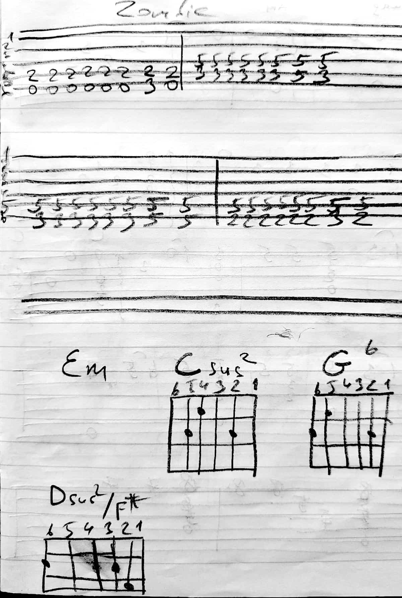
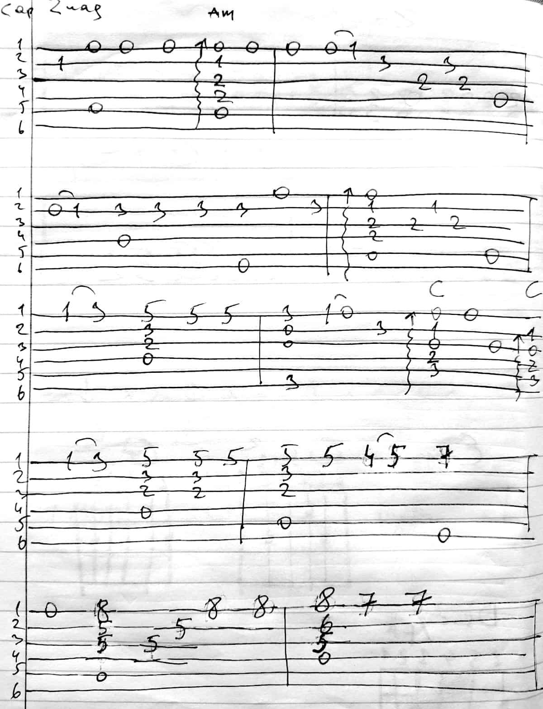
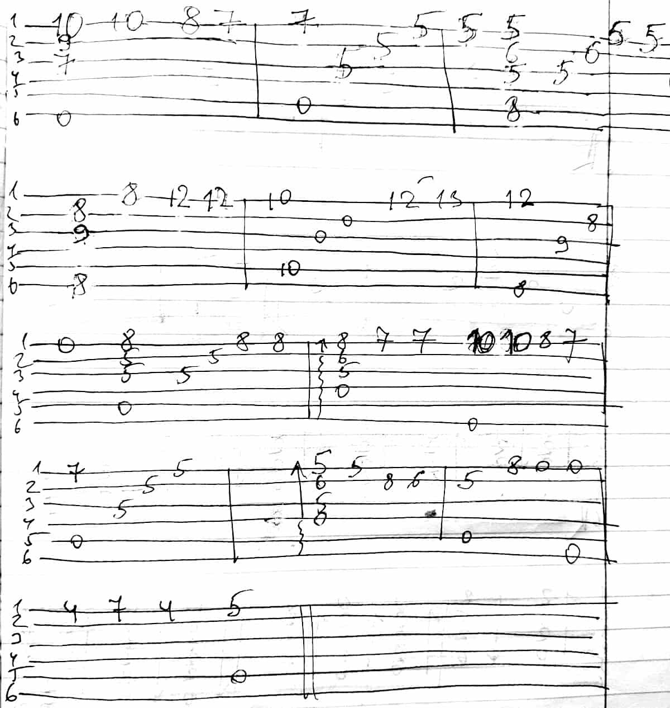

###### [Back](../Readme.md)
# [The Cranberries - Zombie](text.md)
### Тональность Am
### Проигрыш
```
1) -----------------|-----------------|
2) -----------------|-----------------|
3) -----------------|-5-5-5-5-5-5-5-5-|
4) -2-2-2-2-2-2-2-2-|-3-3-3-3-3-3-5-3-|
5) -0-0-0-0-0-0-3-0-|-----------------|
6) -----------------|-----------------|

1) -----------------|-----------------|
2) -----------------|-----------------|
3) -----------------|-----------------|
4) -5-5-5-5-5-5-5-5-|-5-5-5-5-5-5-5-5-|
5) -3-3-3-3-3-3-5-3-|-2-2-2-2-2-2-3-2-|
6) -----------------|-----------------|

2) -5-6-3-5-1-3-0-1-0-----
3) -------------------0-0-
```
### Куплет и припев
```
Am F C G
```
### Тональность (Ем)



